# Mollae

> **회사 모니터에 띄워놔도 곁눈질로는 일하는 화면처럼 보이는** Instagram · Threads · X 데스크탑 뷰어.
> macOS · Windows 겸용. 6 가지 위장 모드 + PIN 잠금 + Boss Key.

[](https://github.com/01-june-0/mollae-releases/releases/latest)

출시명 **Mollae** (한글: 몰래).

> **이 저장소는 공개 배포 + 문서 전용입니다.** 소스 코드는 비공개로 관리됩니다.

<table>
  <tr>
    <td>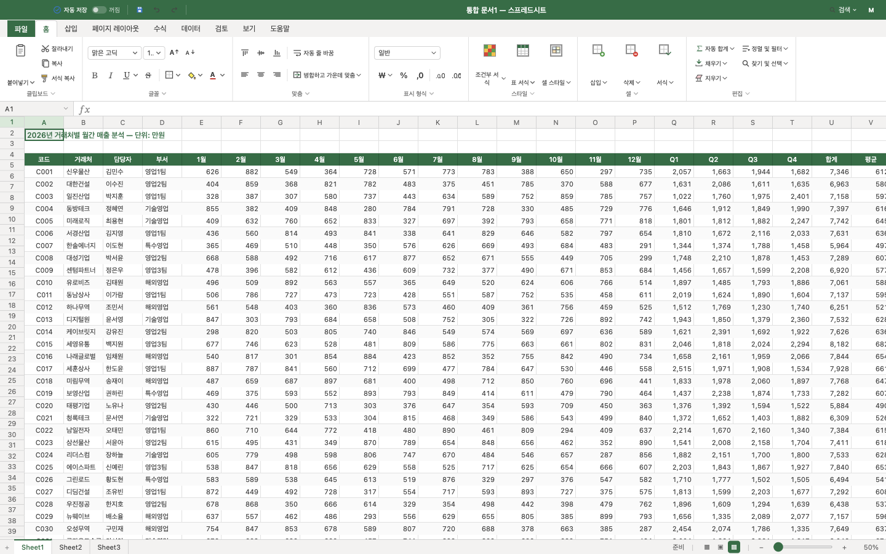</td>
    <td>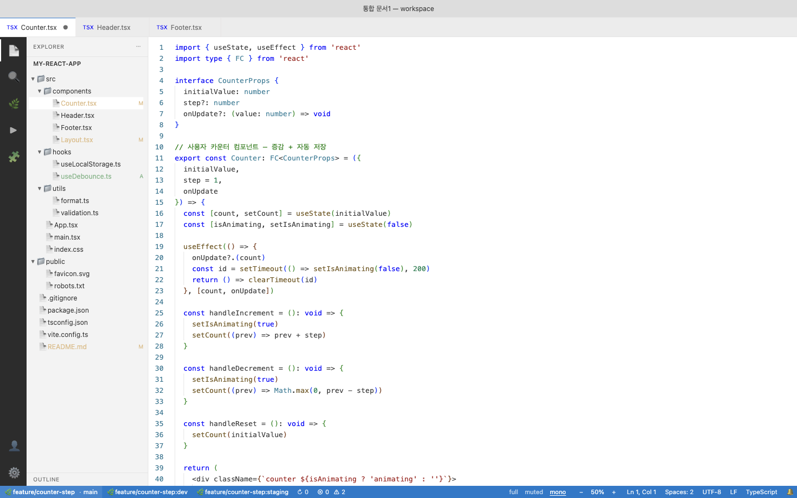</td>
    <td>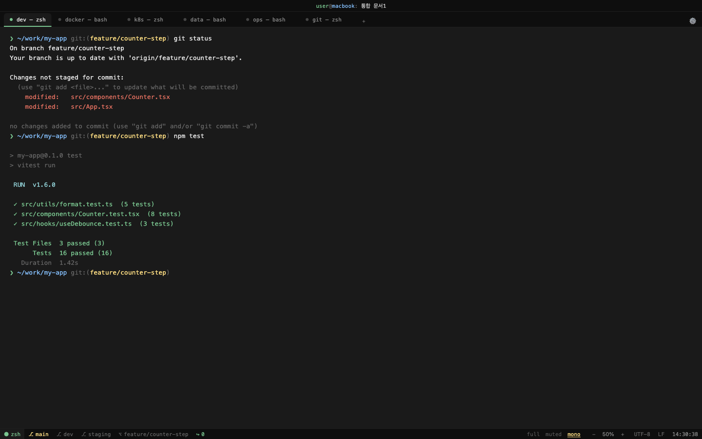</td>
  </tr>
  <tr>
    <td>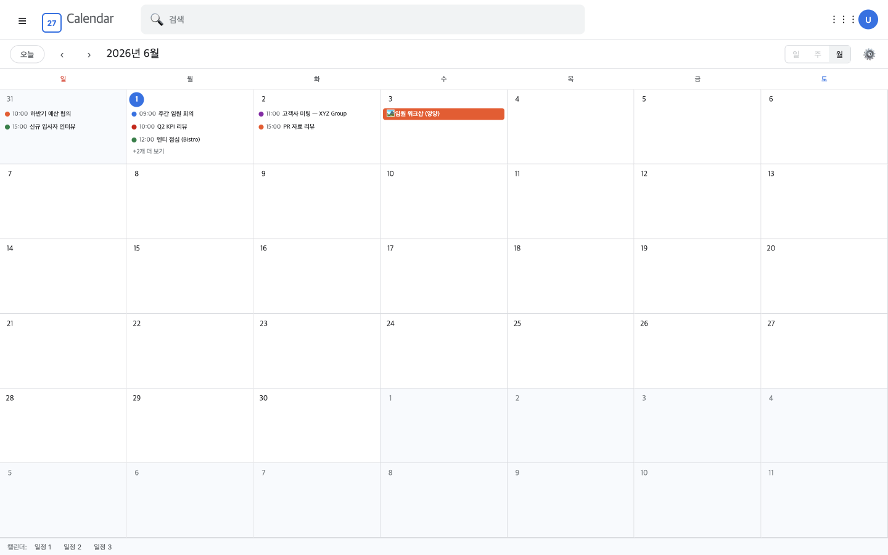</td>
    <td>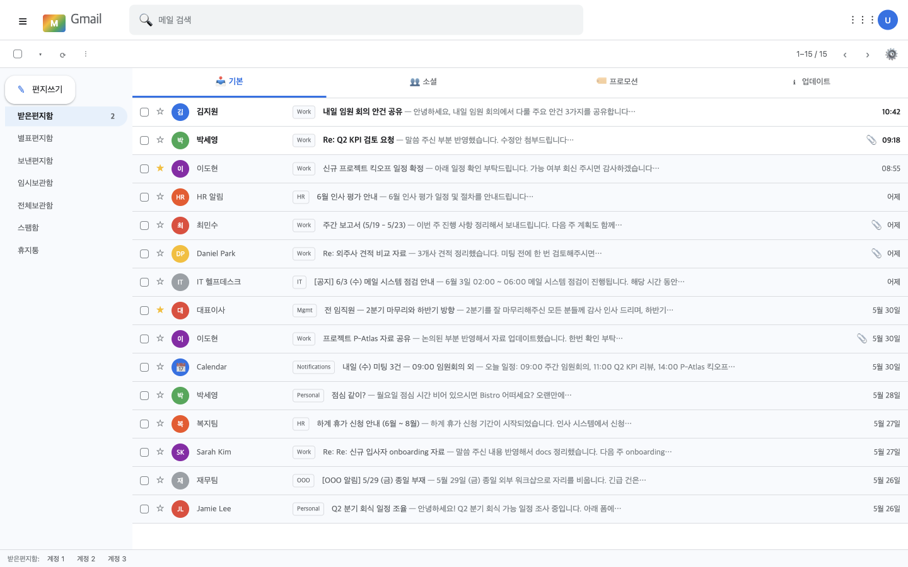</td>
    <td>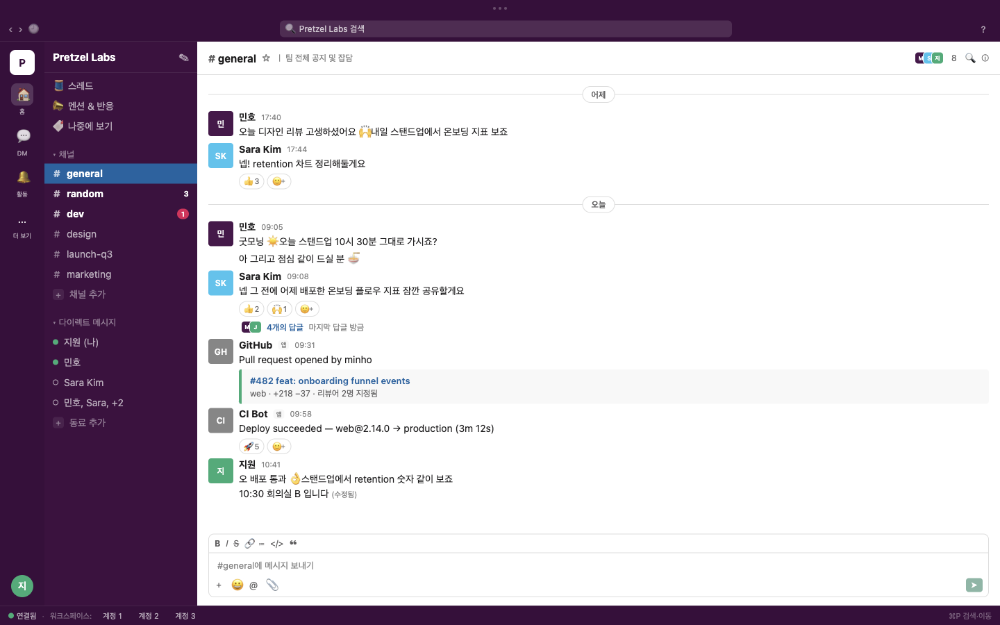</td>
  </tr>
</table>

---

## 📦 다운로드

[**최신 릴리즈**](https://github.com/01-june-0/mollae-releases/releases/latest) 페이지에서 OS 산출물 다운로드:

| OS | 파일 |
|---|---|
| macOS Apple Silicon | `Mollae-X.Y.Z-arm64.dmg` |
| macOS Intel | `Mollae-X.Y.Z-x64.dmg` |
| Windows | `Mollae-X.Y.Z-Setup.exe` |

**자동 업데이트** 지원 — 옵션 → 일반 → 자동 업데이트 → "지금 확인" 또는 백그라운드 자동.

### 처음 열 때 경고 우회 (미공증 빌드)

> Mollae 는 ad-hoc 서명만 적용된 미공증 앱이라, 다운로드한 앱을 처음 열 때 macOS 가
> *"악성 코드가 없음을 확인할 수 없습니다"* 경고를 **한 번** 띄웁니다. (정상이며,
> 아래 방법으로 한 번만 허용하면 이후엔 바로 열립니다.)

**macOS** — 먼저 DMG 안에서 바로 실행하지 말고 **앱을 `응용 프로그램`(Applications)으로 드래그**한 뒤, 다음 중 하나:

1. **시스템 설정 → 개인정보 보호 및 보안** → 아래로 스크롤 → *"‘Mollae’이(가) 차단되었습니다"* 옆 **"그래도 열기"** → 인증 → 다시 뜨는 창에서 **"열기"**
2. 또는 터미널에서 다운로드 표식(quarantine) 제거 — **가장 확실**:
   ```bash
   xattr -dr com.apple.quarantine /Applications/Mollae.app
   ```
   이후 더블클릭하면 경고 없이 바로 열립니다.

> ⚠️ 최신 macOS(Sequoia 이상)에선 **우클릭 → 열기 우회가 막혀** 위 1·2번을 사용하세요.
> 읽기 전용 DMG 안에서는 `xattr` 가 적용되지 않으니 반드시 Applications 로 옮긴 뒤 실행하세요.
> 만약 *"손상되었기 때문에 열 수 없습니다"* 가 뜨면 **v0.8.5 이하** 구버전이니
> 최신 릴리즈로 재설치하거나 위 `xattr` 명령 후 여세요.

**Windows**: SmartScreen 경고 → "추가 정보" → "실행"

---

## 🎭 6 가지 위장 모드 — 직군에 맞게 선택

| 위장 | 누구에게 |
|---|---|
| **Excel 스프레드시트** | 사무직·마케팅·재무 |
| **VSCode 에디터** | 개발자 (TS/Python/Bash/YAML) |
| **터미널 에뮬레이터** | 데브옵스·SRE (cross-platform 다크) |
| **Google Calendar** | PM·영업·일정 헤비 사용자 |
| **Gmail** | 매니저·CS·세일즈·이메일 헤비 |
| **Slack** | 메신저 헤비 직군 (대부분의 사무직) |

옵션 → 일반 → 위장 dropdown 에서 즉시 전환. 시트별로 각 위장의 시나리오를 따로 저장하므로, 같은 사람이 여러 분기를 운영할 수 있음.

### Excel 위장
|  | 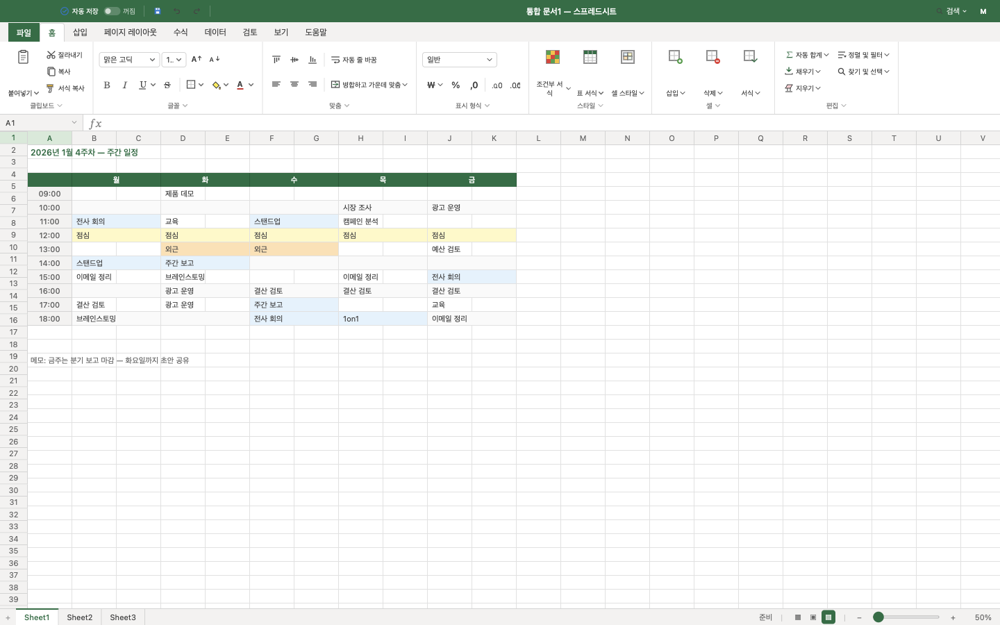 |
|---|---|
| 셀 그리드 · 차트 셀 · 사용자 메모 · CSV import | Boss Key — 가짜 주간 일정표 |

### VSCode 위장
|  | 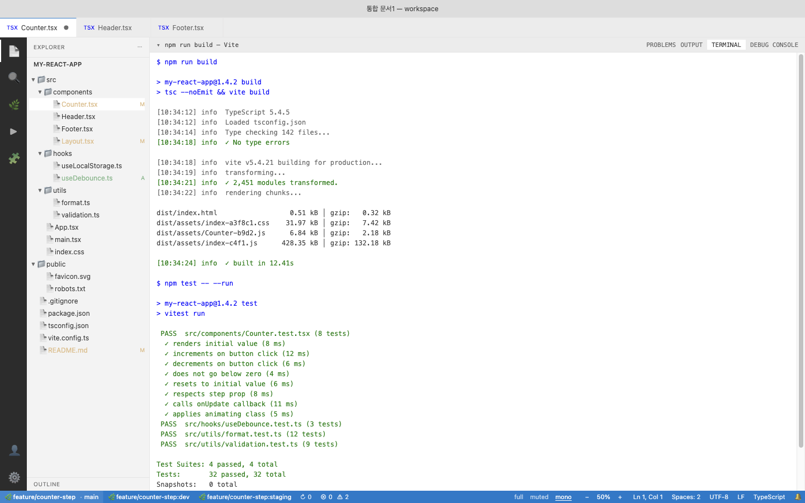 |
|---|---|
| ActivityBar · Sidebar · syntax highlighting · indent guide · bracket pair | `` Cmd+` `` — vitest/pytest/kubectl 등 빌드 로그 |

### 터미널 위장
|  | 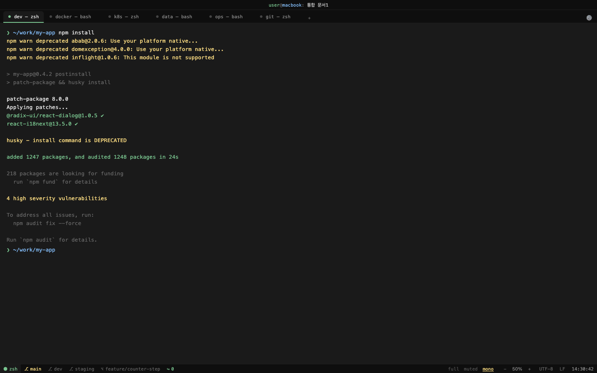 |
|---|---|
| Warp/Hyper/Win Terminal 류 다크 터미널 · ANSI 색상 · 6 시나리오 | `` Cmd+` `` — npm install / docker pull / kubectl rollout 스트리밍 |

### Google Calendar 위장
|  | 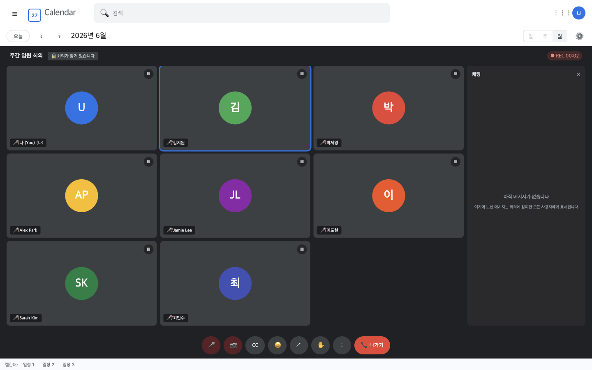 |
|---|---|
| 월간 뷰 · 색 이벤트 chip · 4 시나리오 | `` Cmd+` `` — Google Meet 회의 화면 (9-tile + REC 카운터) |

### Gmail 위장
|  | 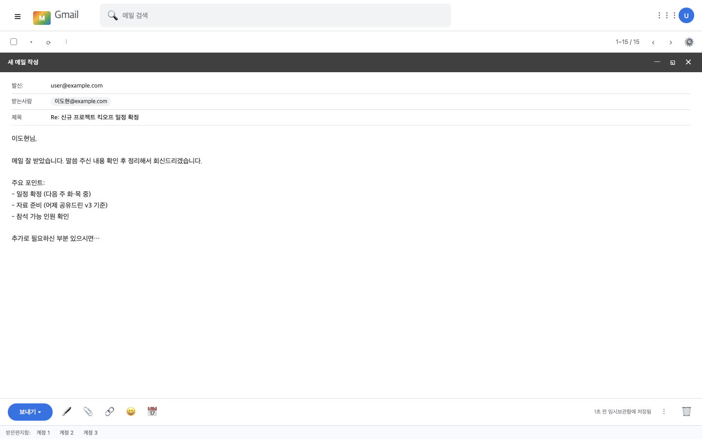 |
|---|---|
| 받은편지함 · 카테고리 탭 · 라벨 · 4 시나리오 | `` Cmd+` `` — 가짜 메일 작성 풀스크린 |

### Slack 위장
|  | 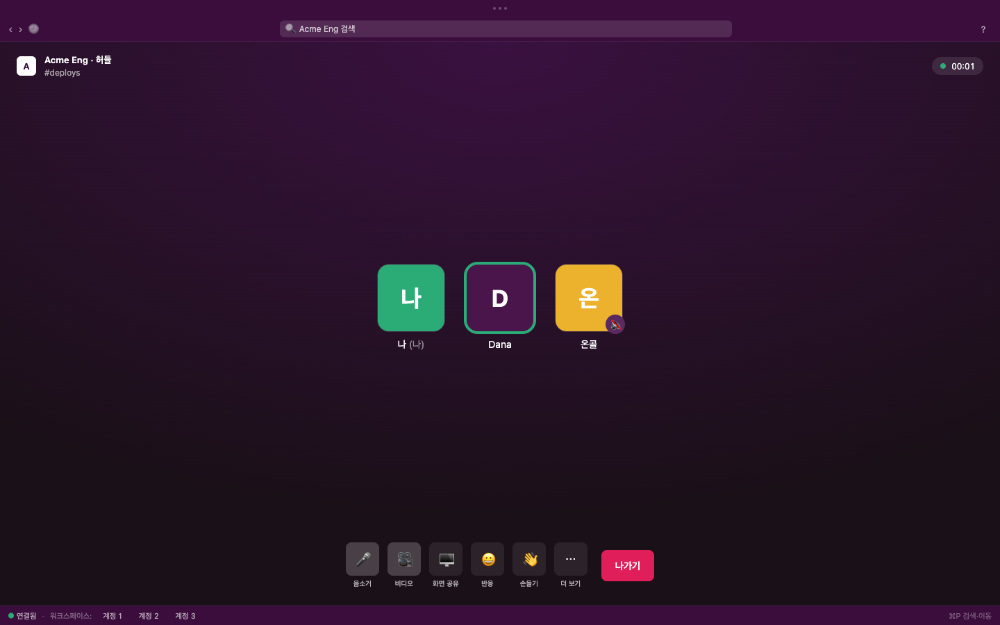 |
|---|---|
| 어버진 사이드바 · 채널/DM · 스레드 · 봇 첨부 · 4 시나리오 | `` Cmd+` `` — 풀스크린 허들(음성통화) 화면 |

---

## 🎯 컨셉

평소엔 위장 화면 (Excel / VSCode / Terminal / Calendar / Gmail / Slack) 으로 가득. 마우스를 우측 하단의 호버 영역에 올리면 그 자리에 SNS 피드 — Instagram · Threads · X — 가 펼쳐짐. 곁눈질로는 위장 앱.

누가 다가오면 단축키 한 번에:
- **Boss Key** (`` Cmd+` ``) — 위장별 풀스크린 대피 화면 (일정표 / 빌드 로그 / npm install / Meet 회의 / 새 메일 작성)
- **PIN 잠금** (`Cmd+L`) — 4자리 PIN 입력화면 (옵션에서 자동잠금·앱 시작·Boss key 해제 시 트리거 가능)

타겟: 회사 사무직 + 수동 SNS 조회. **마케터·인플루언서·자동화 도구 사용자는 타겟 아님.**

---

## ⌨️ 단축키

| 기능 | macOS | Windows |
|---|---|---|
| Boss Key (위장별 풀스크린) | `` Cmd+` `` | `` Ctrl+` `` |
| 시트 전환 (1·2·3) | `Ctrl+1` · `2` · `3` | `Ctrl+1` · `2` · `3` |
| 필터 (일반·차분·흑백) | `Cmd+1` · `2` · `3` | `Alt+1` · `2` · `3` |
| 즉시 잠금 | `Cmd+L` | `Ctrl+L` |
| 긴급 로그아웃 | `Cmd+Shift+L` | `Ctrl+Shift+L` |
| 위장 빠른 보기 (disguise별 분기) ¹ | `Cmd+P` | `Ctrl+P` |
| 메모 검색 (모든 disguise 가로질러) | `Cmd+F` | `Ctrl+F` |
| 도움말 | `F1` | `F1` |

¹ `Cmd+P` 동작은 활성 disguise 에 따라:
- **Excel** → 인쇄 미리보기 위장 (A4 페이지 형식)
- **VSCode** → Quick Open 파일 검색 (시나리오 점프)
- **Terminal** → fzf 풍 history 검색 (시나리오 점프)
- **Calendar** → 이벤트 검색
- **Gmail** → 메일 검색
- **Slack** → Quick Switcher (채널·메시지 검색)

모든 단축키는 옵션 → 단축키에서 변경 가능 (Electron accelerator 표기법).

---

## 🔒 보안

### PIN 잠금
- **4자리 숫자 PIN** + 가상 키패드 + 5 회 실패 시 30 초 lockout
- **세 트리거 독립 토글**: 자동잠금 (idle) · 앱 시작 시 · Boss Key 해제 시
- **PIN 분실 시 master reset** — 잠금 화면 안에서 "RESET" 입력 → 모든 데이터 wipe + 재시작

### 데이터 저장 정책
- ID/PW **직접 저장 안 함** — partition 쿠키 격리 방식만 사용 (브라우저처럼)
- PIN 은 SHA-256 + 16 바이트 random salt 로 해시되어 로컬에만 저장
- 메모·CSV·설정은 평문 JSON 으로 저장 (자동 백업 활성 시 타임스탬프 복사본 함께)
- **긴급 로그아웃** — 모든 SNS partition 의 `clearStorageData()`. 되돌릴 수 없음.

### 면책
- Meta/X 무관. 비공식 뷰어이며 ToS 준수 — DOM 미조작, 표준 Chrome UA 위장.
- 이 앱의 사용 결과 (회사 정책 위반 등) 는 **사용자 본인 책임**.

---

## 🧬 기능 요약 (버전별)

| 버전 | 핵심 |
|---|---|
| **v0.1** | MVP — Excel 위장 + Boss Key + 멀티계정 + Instagram·Threads·X |
| **v0.2** | 시나리오 7종 + CSV import + 셀 메모 + 자동잠금 + 긴급 로그아웃 |
| **v0.3** | 인쇄 미리보기 + 차트 셀 + 메모 검색 + 자동 백업 + 자동 업데이트 |
| **v0.4** | **DisguiseProfile 추상화** + **VSCode 위장** (시나리오 6종) |
| **v0.5** | **PIN 잠금** 패키지 (3 트리거) + 시나리오 즐겨찾기 |
| **v0.6** | **Terminal 위장** (시나리오 6종) |
| **v0.7** | 일관성 정착 (5 disguise 사이 UX 통합) |
| **v0.8** | **Google Calendar** + **Gmail** (각 시나리오 4종) |
| **v0.9** | **Slack 위장** (시나리오 4종 · 허들 · Quick Switcher · 메시지 메모) + Gmail·Calendar 로고 폴리시 |

전체 변경 이력: [`docs/CHANGELOG.md`](docs/CHANGELOG.md)

---

## 라이선스

UNLICENSED (개인용 알파, 모든 권리 보유). 외부 사용·재배포 권한 별도 부여 없음.

---

🤖 코드 작성은 Claude Code 와 함께 진행됨.
